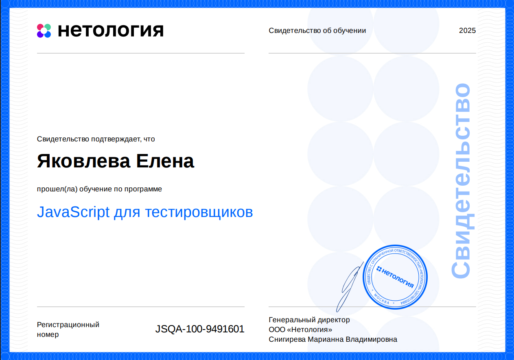

### Домашние задания по блоку "Введение в JavaScript"
1. [Знакомство с JavaScript: часть 1](https://github.com/Elena-Yakovleva/JavaScript-project/blob/main/lection1/README.md)
     * [Условия задач](https://github.com/Elena-Yakovleva/JavaScript-project/blob/main/lection1/task/First.md)
       * [Задача 1. Посчитать налоги](https://github.com/Elena-Yakovleva/JavaScript-project/blob/main/lection1/task/sumTask.js)  
       * [Задача 2*. Прогрессивная шкала.](https://github.com/Elena-Yakovleva/JavaScript-project/blob/main/lection1/task/progressiveTax.js)
2. [Основные понятия.](https://github.com/Elena-Yakovleva/JavaScript-project/blob/main/lection2/lection/README.md)
     * [Условия задачи](https://github.com/Elena-Yakovleva/JavaScript-project/blob/main/lection2/README.md)
       * [Функция квадратного уравнения и кредитный калькулятор](https://github.com/Elena-Yakovleva/JavaScript-project/blob/main/lection2/task.js)
3. [Функции.](https://github.com/Elena-Yakovleva/JavaScript-project/blob/main/lection3/lection/README.md)
     * [Условия задачи](https://github.com/Elena-Yakovleva/JavaScript-project/blob/main/lection3/README.md)
       * [Работа с функциями](https://github.com/Elena-Yakovleva/JavaScript-project/blob/main/lection3/task.js)
4. [Расширенная работа с массивами](https://github.com/Elena-Yakovleva/JavaScript-project/blob/main/lection4/lection/README.md)
     * [Условия задачи](https://github.com/Elena-Yakovleva/JavaScript-project/blob/main/lection4/README.md)
       * [Сравнение и преобразование массивов](https://github.com/Elena-Yakovleva/JavaScript-project/blob/main/lection4/task.js)
5. [Объекты.](https://github.com/Elena-Yakovleva/JavaScript-project/blob/main/lection5/lection/README.md)
     * [Условия задачи](https://github.com/Elena-Yakovleva/JavaScript-project/blob/main/lection5/README.md)
       * [Создание объекта, присвоение ему свойств, удаление свойств](https://github.com/Elena-Yakovleva/JavaScript-project/blob/main/lection5/task.js)
6. [Классы](https://github.com/Elena-Yakovleva/JavaScript-project/blob/main/lection6/lection/README.md)
     * [Условия задачи](https://github.com/Elena-Yakovleva/JavaScript-project/blob/main/lection6/README.md)
       * [Класс Библиотека, класс Студент](https://github.com/Elena-Yakovleva/JavaScript-project/blob/main/lection6/task.js)
7. [Обработка исключений и замыкания.](https://github.com/Elena-Yakovleva/JavaScript-project/blob/main/lection7/lection/README.md)
     * [Условия задачи](https://github.com/Elena-Yakovleva/JavaScript-project/blob/main/lection7/README.md)
       * [Форматтер и Треугольник](https://github.com/Elena-Yakovleva/JavaScript-project/blob/main/lection7/task.js)
8. [Асинхронность](https://github.com/Elena-Yakovleva/JavaScript-project/blob/main/lection8/lection/README.md)
     * [Условия задачи](https://github.com/Elena-Yakovleva/JavaScript-project/blob/main/lection8/README.md)
       * [Будильник](https://github.com/Elena-Yakovleva/JavaScript-project/blob/main/lection8/task.js)
9. [Функции декораторы, оператор “...“, call, apply](https://github.com/Elena-Yakovleva/JavaScript-project/blob/main/lection9/lection/README.md)
     * [Условия задач](https://github.com/Elena-Yakovleva/JavaScript-project/blob/main/lection9/README.md)
       * [декоратор](https://github.com/Elena-Yakovleva/JavaScript-project/blob/main/lection9/task.js)

### Сертификат об окончании курса

