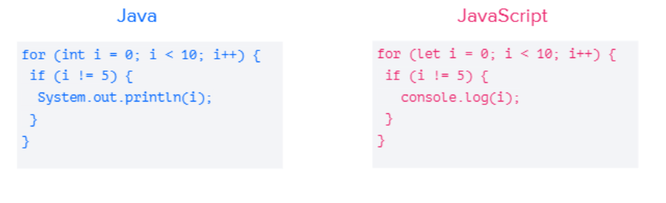
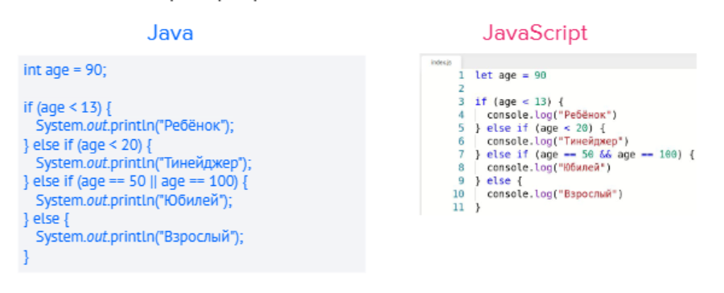
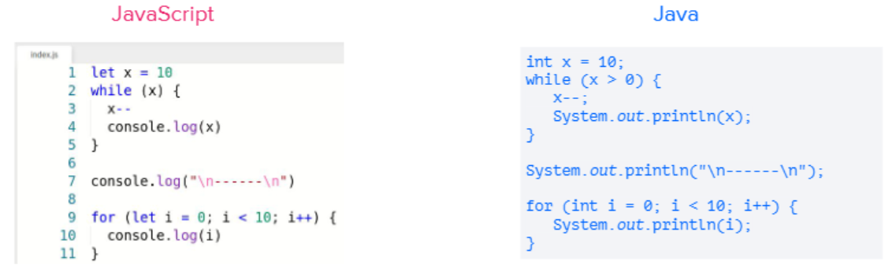
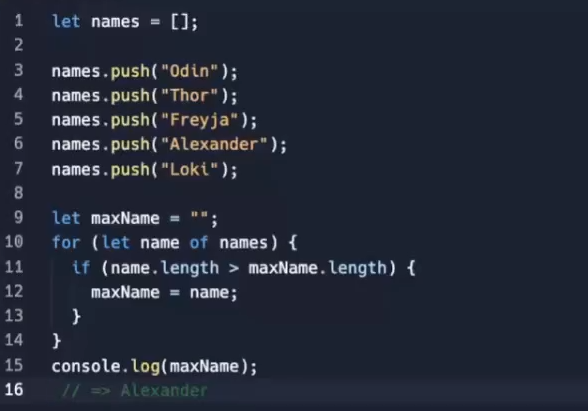

### Лекция 1 "Знакомство с JavaScript"

JavaScript — это язык программирования, который в первую очередь применяют в вебе. С его помощью сайты делают интерактивными: добавляют всплывающие окна, анимацию, кнопки лайков и формы для отправки информации. Его ещё называют главным языком фронтенда — «лицевой» стороны сайта, с которой взаимодействуют пользователи.

#### Особенности JavaScript

1.  JavaScript - это интерпретируемый язык. Код на компилируемых языках нужно сначала пропустить через специальную программу, компилятор, и только потом его можно использовать. Код на интерпретируемом языке компилировать не нужно. Его пишут и сразу передают программе-интерпретатору, которая тут же его выполняет. Это ускоряет разработку, но требует запуска только в связке с интерпретатором. Правда, интерпретатор JavaScript встроен во все современные браузеры, так что проблем с запуском кода нет.
 
2. Мультипарадигменный.

    В программировании существует несколько парадигм:
     * 	Объектная. В ней для каждой сущности в коде, например кнопки заказа, создают объекты. А затем прописывают связи между этими объектами.
     *  Функциональная. В ней больше внимания уделяют конкретным инструкциям. Кнопка здесь — не объект, в коде она обозначена как порядок действий, которые происходят после нажатия.
     *	Императивная. Здесь код пишут как чёткий набор инструкций, который выполняется строго последовательно. Императивная и функциональная парадигма часто применяются вместе.

    Часто языки ориентированы на работу с одной парадигмой. JavaScript не такой — он не диктует, как писать код, и позволяет придерживаться разных стилей и способов.
3. Без строгой типизации. Есть языки программирования со статической типизацией. Если создать переменную, нужно сначала обязательно задать её тип, например число. И ничего, кроме числа, хранить в ней нельзя.

   У языка JavaScript типизация динамическая — в переменную можно положить что угодно. Это облегчает написание кода, но может вызвать ошибки.
4.  Интегрирован с HTML и CSS в браузерах. 
    HTML и CSS — это языки разметки для сайтов. Они не относятся к языкам программирования, так как не позволяют писать функции и что-то обрабатывать. С их помощью задают внешний вид сайта: расположение блоков, размер шрифта, цвета. Чтобы сайт стал интерактивным, нужен язык программирования, и JavaScript тут подходит идеально. Современные браузеры позволяют просто вписать код на JavaScript прямо в разметку, написанную на HTML и CSS, — и всё заработает.

    Часто для удобства скрипты пишут в отдельных файлах, а потом вставляют в код отсылку на сам файл. Это позволяет не перегружать код на странице и использовать одни и те же скрипты в разных местах, не переписывая их заново.
5. Подходит для бэкенда. Код JavaScript можно запускать и в браузере, и на сервере. Это значит, что на нём можно писать не только интерактивные элементы страниц, но и серверную часть сайта: функции обработки данных и вычислений. Правда, для этого нужно освоить отдельный инструмент — Node.js. Это движок, который позволяет запускать JavaScript не в браузере, а на сервере.

JavaScript часто путают с Java. На самом деле это абсолютно разные языки для разных задач. Просто когда-то давно Java был очень популярен и его название добавили в язык JavaScript для привлечения внимания. 



**Переменные** инициируются с помощью ```let``` или ```const```

let - используется в том случае, если в переменной допустимо менять значение

const - если значение менять нельзя, однако это не работает с ссылочными типами данных, такими как Объект или Массив. В этом случае в переменной сохраняется не сама информация, а ссылка на нее, и именно это позволяет изменять информацию внутри данных объектов.

```
const friends = ['Маша, Таня, Оля, Вика']
friends.push('Константин')
console.log(friends); // ['Маша, Таня, Оля, Вика, Константин'];

const info = {
  city:'Moscow',
  age:31,
}
info.gender = 'male'
```

Если вы объявите переменную и не присвоите значение, а затем попытаетесь вынуть из переменной значение, то в Java это будет ошибкой компиляции, в JavaScript же всё выполнится, но в качестве значения будет взято ```undefined```.

"use strict"; - включение строгого режима(strict mode) позволяет 
**Условные операторы**
Условные операторы работают почти так же, как в Java.

JavaScript также разрешает в качестве условия указывать не только булевские значения. В этом случае он посчитает условие как ```false```, если там:
  * 0 
  * пустая строка
  * null 
  * undefined 
  * NaN 

**Циклы**
Циклы также очень похожи: что ```for```, что ```while```.



Так же в JavaScript строки можно сравнивать через ```==```, а не через ```equals```, как в Java

**Массивы**

Массивы в JavaScript являются скорее аналогом списков в Java, так как в них можно менять размер массивов, добавляя или удаляя ячейки из него. Также JavaScript разрешает хранить значения разных типов в одном и том же
массиве


**Функция**

Функция - это именованный участок кода, к которому можно через это имя обращаться.
```
function sum (a, b, c) {
    return a + b + c;
}

console.log(sum(1, 2, 3));
```

