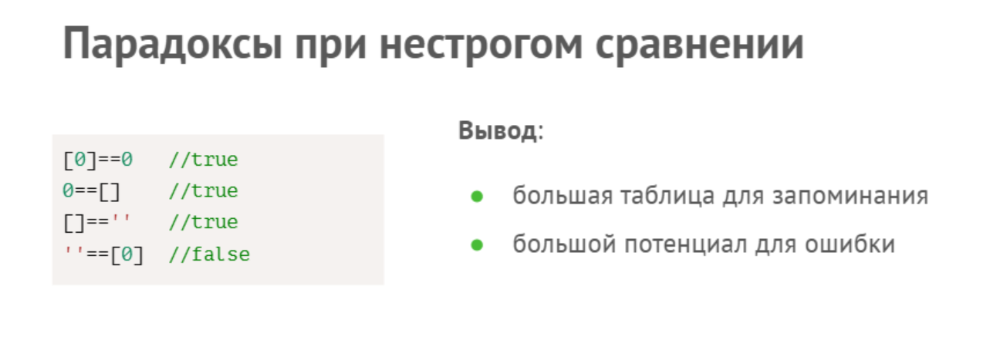

### Основные понятия.

1. Оператор и операнд

Оператор — это команда, которая на письме выглядит как простой символ. С помощью операторов выполняются некоторые действия над данными.
Операнд - это данные, над которым выполняется действие.

Операторы бывают:
  * унарные (англ. unary) - работают с одним операндом 
    * + - оператор контеканации или приведение строки в число 
      ```
      let str = '12,3';
      console.log(typeof str); // строка
      console.log(typeof +str); // число

      ```
    * - - меняет знак у числа
    * ! - меняет булевый тип данных  == true; != false;  !! - приводит любой тип данных к булевому
    * typeOf - определяет тип данных
  * бинарные (англ. binary) - работают с 2 операндами
    * оператор сложения либо конкатенации строк +
    * оператор деления /
    * оператор умножения *
    * оператор вычитания -
    * оператор взятия остатка %
    * оператор присвоения =, +=, -=
    * оператор не строгого сравнения ==
      ```
      let a = 567;
      let c = '567';
      console.log(a == c);
      ```

    * операторы сравнения >, <, >=, <=, !==, === (для сравнения строк).
   
  * тернарный оператор (англ. ternary) - predicat ? option1 : option2   - let isAdult = (age >= 18? 'Взрослый' : 'Ребенок')



2. Шаблонные строки

Шаблоны — это строки, в которые можно подставить значения переменных.
Для этого используется новый тип кавычек и особый синтаксис:  ``` `${имяПеременной}` ```

```
let name = 'User';
console.log(`Приветствую тебя о Великий ${name}`);
```
3. Условные операторы

Примеры условных операторов
   * И - &&  
   * ИЛИ - ||

4. Конструкция switch

switch позволяет выполнять различные блоки кода в зависимости от значения переменной. Она заменяет собой сразу несколько if и представляет собой более наглядный способ сравнить выражение сразу с несколькими вариантами.

```
let name = 'Вася';
   switch (name) {
    case 'Admin':
      console.log('Приветствую тебя');
      break;
    case 'Moderator':
      console.log('Здрасти');
      break;
    case 'User': 
      console.log('Привет');
      break;
    default: console.log('Привет ' + name);
}
```

5. Работа с числами

Методы, которые можно использовать вместе с числами
* .toFixed(х) - выводит первые х числа после запятой
* Math.floor(); // Округляет в меньшую сторону
* Math.round(); // Округляет к ближайшему целому
* Math.ceil(); // Округляет в большую сторону
* Math.trunc(); // Убирает дробную часть

Infinity - математическая бесконечность\
```
1 / 0          // дает Infinity
5 * Infinity   // дает Infinity
5 / Infinity   // дает 0
```

NaN является значением, представляющим не-число (Not-A-Number), возникает, когда математические функции не могут вернуть значение 

```
console.log(parseInt('aaaa')); // NaN
console.log(typeof NaN); // "number"
console.log(NaN === NaN); // false
console.log(Number.isNaN(NaN)); // true - Для проверки, что переменная — NaN, следует использовать Number.isNaN()

``
6. Работа со строками
Строки создаются при помощи двойных или одинарных кавычек:
```
let text = "это строка";
let anotherText = 'ещё одна строка';
let str = "012345"; 
let result = `Привет, меня зовут ${name}, мне ${10+9} лет, я ${job}`;
```

* \n Перевод на новую строку
* \t Символ табуляции
* \uNNNN Любой юникод символ с шестнадцатеричным кодом
* \' Экранирование одинарной кавычки

Методы 
* .charAt() - позволяет выбрать символ из строки
```
let myString = "моя строка";
console.log(myString[30]); // undefined
console.log(myString.charAt(30)); // ""
```
* .length - получение длины строки
* .toLowerCase() и .toUpperCase() меняют регистр строки на нижний и верхний
* indexOf(искомая_строка[,начальная_позиция]) // используется для поиска строки в строке
* str.slice(beginIndex[, endIndex])  // извлечение  части строки
* сравнение символов  и строк (сравнение идет между номерами каждого символа в формате юникод)
```
console.log('а' > 'Я'); // true
console.log('abc' > 'abd'); // false
```
* str.localeCompare(str2,[locale]) // сравнивает строки с учетом языка
* String.fromCharCode(code) // возвращает символ по коду
* str.charCodeAt(pos)  // возвращает код символа на позиции pos

7. Специальные символы
```
console.log('I\'m a JavaScript programmer'); // I'm a JavaScript programmer
console.log('\u262D \u262A \u2766 \u2713 \u262F \u2328'); // ☭ ☪ ❦ ✓ ☯ ⌨
```

8. undefined -данное сообщение выводится только в том случае если переменная не обладает значением
```
let a;
console.log(a);
```

9. null - примитивное значение, которое представляет собой намеренное отсутствие какого-либо значения объекта.

10. Преобразование типов

```
//К числу
console.log(parseFloat('3.14')); // 3.14
console.log(parseInt("13") + 6); // 19
console.log(+"3.13"); //3.13
//К строке
console.log(String(123)); // "123"
console.log(''+12345); // "12345"
// К булеву
console.log(Boolean(123)); // true
console.log(!!123); // true
// Новые типы
let s = new Symbol("symbol_name"); // Symbol
const theBiggestInt = 9007199254740991n; // BigInt
const alsoHuge = BigInt(9007199254740991); // BigInt
```