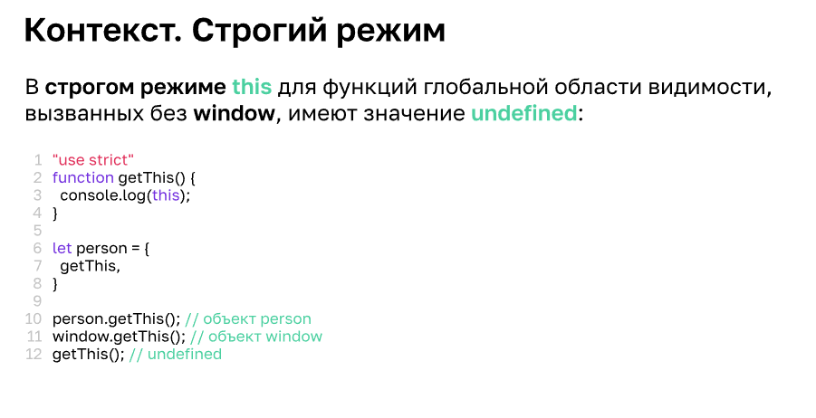
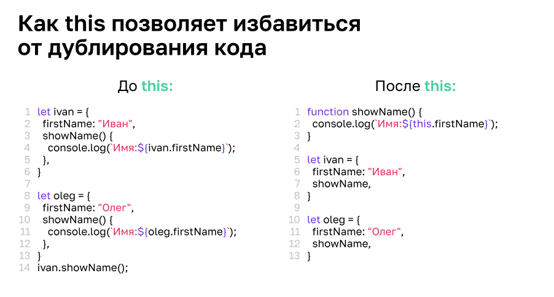

### Функции

**Чистые функции** - это функции, которые после вызова каждый раз предоставляют один и тот же результат.

REST операторы
... - используется для того, чтобы собрать аргументы функции в массив

```
function printArgs(name, ...args) {
    console.log(name, args);
}

printArgs(1,2,3,4,5,6); //   1 [ 2, 3, 4, 5, 6 ]

```

**Функциональное объявление** - это когда функцию можно использовать в любой части кода, как до написания этой функции, так и после 
```
console.log(sum(1,2,3,4));
function sum(...args) {
    let sum = 0;
    for (let i = 0; i < args.length; i++) {
        sum += args[i];
    }
    return sum;
}
```

**Фунциональное выражение** - это когда функция записывается в константу, в этом случае вызвать функция можено только после того, как она объявлена

```
const sum = function (...args) {
    let sum = 0;
    for (let i = 0; i < args.length; i++) {
        sum += args[i];
    }
    return sum;
}

console.log(sum(1,2,3,4));
```
**Стрелочные функции** - позволяют упростить написание кода.

```
let sum = function(a, b) {
    return a + b;
}

let sumArrow = (a, b) => a + b;
```

**Контекст выполнения**
Функция является частью объекта, внутри которого она выполняется.

Обратиться к функции можно через this или window (на глобольном уровне)

```
let user = {
    name: 'Oleg',
    getName: function () {
        return this.name;
    }
}
console.log(user.getName());
```




**Функция высшего порядка**  -  это функция, принимающая в качестве аргументов другие функции или возвращающая другую функцию в качестве результата

**Анонимные и самовызывающиеся функции**
Данная функция не имеет имени - результат сохраняется в переменной result. Если обернуть функцию в скобки () и добавить в конце (), то в переменной будет  сохранена не сама функция, а результат ее выполнения.  
```
let result = (function (){
  let count = 0;
  function printCounter(){
    console.log(count);
  }

  function incrementCounter(){
    count++;
  }

  return [printCounter, incrementCounter];
})()
```

