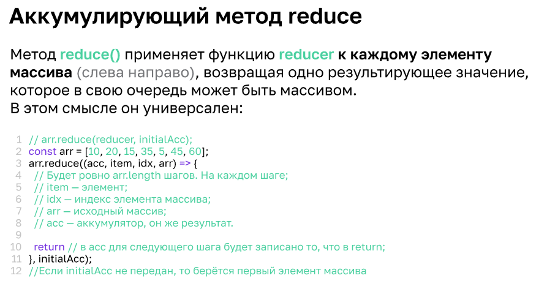

### Расширенная работа с массивами

Муталельность - это способность изменяться, приспосабливаться, выполнять свои функции в новых условиях. В программировании это означает, что объект может быть изменён после создания. 

Иммутабельность - невозможность изменнеия после создания.


```
arr.push("Jane", "Mary", "Susen");    // добавление нескольких элементов в массив
arr.pop();                            // удаление последнего элемента из массива
arr.unshift("Susen");                 // добавляет элемент в начало массива
arr.shift();                          // удаляет первый элемент массива

```

**Итерация по массиву**

Итерация по массиву происходит с помощью цикла.

```
function logArray(arr) {
    if(Array.isArray(arr)) {       // проверка введенного аргумента на то, что он является массивом
       for(let element of arr) {
        console.log(element);
       }
    } else {
        console.log(`${arr} - не является массивом`);
    }
}

logArray(arr); // выводит построчно все элементы массива
logArray(123); // выводит: 123 - не является массивом
logArray();    // выводит: undefined - не является массивом
```

```arr instanceof Array``` - оператор instanceof позволяет осуществлять проверку является ли объект массивом, так же как метод ```Array.isArray()```

**Преобразование элементов в массив:**

```
// преобразует внесенный аргумент из строки в массив букв
function logArr(arr) {
    let array = Array.from(arr);      
    for(let element of array) {
        console.log(element);
    }
}

// преобразует любые внесенные аргументы в массив и выводит построчно каждый элемени
function logArr() {
    let array = Array.from(arguments);      
    for(let element of array) {
        console.log(element);
    }
}
//современная запись функции через РЕСТ
function logArr(...arr) {    
    for(let element of array) {
        console.log(element);
    }
}

```

**Перебор элементов в массиве**

```
let numbers = [1, 2, 3, 4, 5, 6, 7, 8, 9];

// через обычный цикл с привязкой к элементу по его позиции
for(let i = 0; i < numbers.length; i++) {
    console.log(numbers[i])
}

//через for-of - то есть цикл сразу будет перебирать элементы массива
for (let number of numbers) {
    console.log(number);
}

//цикл for-in -  работает так же как for-of, но перебирает свойства объекта - в данном случае, будут показаны ключи к элементам массива
for (let number in numbers) {
    console.log(number);
}
// чтобы в этом виде цикла обратится именно к элементу, необходимо  прописать в цикле , что обращение идет именно к свойству
for (let position in numbers) {
    console.log(numbers[position]);
}

//метод .forEach

numbers.forEach((item, index, arr) => console.log(`Номер ячейки: ${index}; Номер элемента: ${item}`))
```

**Поиск по массиву**

* перебором с помощью цикла
```
let searchName = "Mary"
for (let name of arr) {
    if (name === searchName) {
        console.log(name);
        break;
    }
}
```
* через метод indexOf
```
arr.indexOf(searchName)
arr.indexOf(searchName, 2)  //добавление 2 указало с какого элемента осуществлять поиск

//проверка на -1 означает на проверку к false, то есть на то, что элемент в массиве отсутствует, и только после этого вывода результата в консоль
arr.indexOf(searchName)
if(arr.indexOf(searchName) !== -1) {
    console.log(`Мы нашли элемент ${searchName}`);
}
```
* так же можно использовать метод includes - результат выводится в значении true / false
```
if(arr.includes(searchName) !== -1) {
    console.log(`Мы нашли элемент ${searchName}`);
}

// в случае если в массиве несколько одинаковых элементов
// .indexOf - выводит номер первого элемента
// .lastIndexOf - выводит последний элемент
```

**Расширенный поиск в массиве**

Императивный подход - полностью описывает каждое необходимое действие, чтобы достичь поставленной задачи.

Декларативный код — описывает задачу и ожидаемый результат(код выклядит компактнее, но не понятно какими шагами достигнут результат)

* метод .findIndex — идентичен методу indexOf, однако в качестве аргумента может принимать функцию высшего порядка
```
function checkNumber(number) {
    return number % 3 === 0;
}
numbers.findIndex(checkNumber);

//можно упростить 
numbers.findIndex(number => number % 3 ===0 ); // может принимать в себя аргументы number, index, arr
```
* метод .find - осуществляет поиск самого элемента, и если он есть выводит его
```
numbers.find(number => number % 3 === 0 && number % 2 === 0); // выведет элемент в который соответствует обоим условиям
```
* метод .some - проверяет есть ли в массиве элемент, который  подходит под наши параметры
```
numbers.some(element => element % 3 === 0 ) // выводит true или false
```
* метод .every - проверяет соотвветствуют ли условию все элементы массива
```
numbers.every(element => element % 3 === 0 ) // выводит true или false
```
Примеры использования методов в поиске по массиву:
```
const staff = [
    {name: "Мария", departament: "IT", salary: "75000"},
    {name: "Иван", departament: "Продажи", salary: "55000"},
    {name: "Николай", departament: "IT", salary: "92000"},
    {name: "Мария", departament: "маркетинг", salary: "45000"}
]

staff.find(staff => staff.name === "Мария" && staff.departament === "IT"); //  {name: 'Мария', departament: 'IT', salary: '75000'}
staff.some(staff => staff.salary >= "90000"); //true
staff.every(staff => staff.salary >= "50000"); //false
```
* метод .filter - метод фильтрации на четность элементов / нечетность
```
const numbers = [1,2,3,4,5,6,7,8,9,5,7,6,2,1,8,2];

numbers.filter(number => number % 2 === 0); //  [2, 4, 6, 8, 6, 2, 8, 2]
numbers.filter(number => number % 2 !== 0); //  [1, 3, 5, 7, 9, 5, 7, 1]
numbers.filter(number => number % 3 === 0);  // [3, 6, 9, 6]

staff.filter(staff => staff.name === "Мария"); // выведет массив из двух элементов, в которых встречается имя Мария
// 0: {name: 'Мария',departament: 'IT', salary: '75000'}
// 1: {name: 'Мария', departament: 'маркетинг', salary: '45000'}
```
**Преобразование массива**

```
//императивный подход
let salary =[];
for (let people of staff) {
    salary.push(people.staff);
}

//через мап

let salary = staff.map(staff => staff.salary) //создается новый массив, в котором находится только нужное свойство

```
* клонирование массива
```
//через обычный цикл
сonst numCopy = [];
for (let element of numbers) {
   numCopy.push(element);
}
//через методы
const numCopy1 = numbers.slice();  // метод сохраняет кусок массива в новый, но без аргументов обрезка идет с 0 до последнего элемента
const numCopy2 = numbers.map(i => i); // метод переносит каждый элемент массива в новый массив
const numCopy3 = [...numbers]; // вывод REST аргумента сначала упаковывает массив в строку, а затем переводит обратно в массив
const numCopy4 = JSON.parse(JSON.stringify(numbers)); // так же преобразовывает массив с строку, затем строка переводится через parse снова в массив
//массивы содержат одинаковые элементы но они не являются равными друг другу.
```
* сортировка массива
```
const price = [15,78,35,123,567,6,456,7,466,7,12335,5354,45];
arr.sort(); // [ 'Ann', 'Fox', 'Helen' ]
price.sort(); // [ 123, 12335, 15, 35, 45, 456, 466, 5354, 567, 6, 7, 7, 78] - сравнение по первым элементам
price.sort((a, b) => a - b); // [6, 7, 7, 15, 35, 45, 78, 123, 456, 466, 567, 5354, 12335] - массив от меньшего к большему
price.sort((a, b) => b - a); // [12335, 5354, 567, 466, 456, 123, 78, 45, 35, 15, 7, 7, 6] -  от большего к меньшему
console.log(arr);
console.log(price);

```
* метод .reduce() 

```
const price = [15,78,35,123,567,6,456,7,466,7,12335,5354,45];

//сумма элементов

price.reduce((acc, item) => acc += item, 0);

//умножение каждого элемента на следующий

let price = price.reduce((acc, item) => 
{return acc * item }, 1);

//вычисление  четных элементов и вывод их в отдельный массив
const evenNumbers = [];
price.reduce((acc, item) => {
    if (item % 2 === 0 ) {
    acc +1;
    evenNumbers.push(item);
    } 
    return acc;
    }, 0);

// вывод среднего значения

let averagePrice = price.reduce((acc, item, index, arr) => { 
    acc += item;
    if (index === arr.length - 1) {
        return acc / arr.length;
    }
    return acc;
    }, 0);
```
