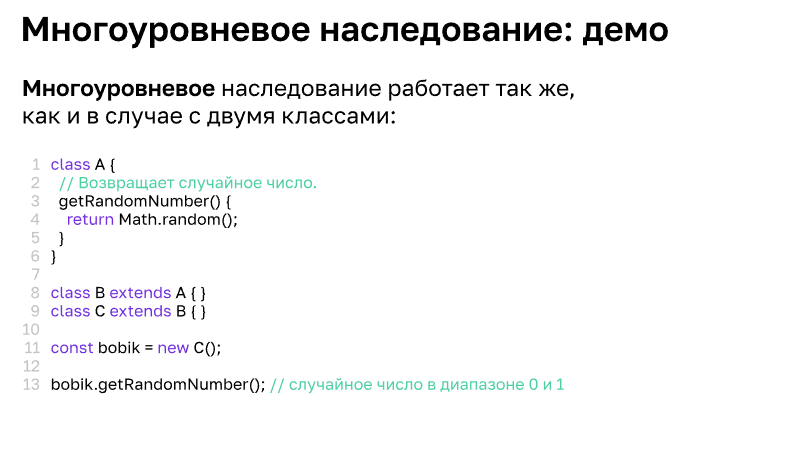

### Классы

1. Объектно-ориентированное программирование
 * ООП - методология разработки программ, в которой все важные вещи являются объектами.
 * Каждый объект построен по определенным правилам, которые называют классом.
 * Классы основываются друг на друге(наследуются).
 Принципы ООП
 * абстракция - рассмотрение объекта реального мира в контексте конкретной задачи
 * инкапсуляция - сокрытие внутренней реализации
 * полиморфизм - возможность работы с объектом, как с абстракцией
 * наследование - передача характеристик одного объекта другому

2. Конструкция class и функции-конструкторы

   Конструкция представляет собой макет, по которому будет создан конкретный объект.
   Создание конструктора в классе необходимо для выделения места в области памяти для свойств данного объекта, а так же первоначальных настроек объекта.
```
//описание класса
class User {
  constructor(name, lastName, age = null) {
    this.userName = name;
    this.userLastName = lastName;
    this.userAge = age;
  }
}

//создание объекта класса
let user = new User {
}
//для работы с классом JavaScript преобразует объект к типу "функция".

// при создании массива объектов не обязательно сохранять каждый новый объект в своей переменной 
// let players = [
   new User("Oleg", "Petrov", 17),   // вывод - Oleg Petrov 17
   new User("Igor", "Ivanov", 25),   // вывод - Igor Ivanov 25
   new User("Pavel", "Romanov")      // вывод - Pavel Romanov null
   ];
```

3. Методы, get, set

Методы реализованные внутри класса будут доступны каждому из созданных объектов
```
class Sportsman {
  constructor() {
    this.scores = [];
  }

  addScores(...scores) {
     for ( let score of scores) {
       this.scores.push(score);
     }
  }

  calculateAverage() {
    if (this.scores.length === 0) {
      return 0;
    }
    return this.scores.reduce((acc, item, i, arr) => acc + item / arr.length, 0);
  }
}
```
* Кастомные методы - это методы, которые могут вызываться в разных классах, но находятся за пределами этих классов, обычно реализуются в виде внешних функций или утилитных функций. Данные методы появились в ES6

``` 
function calculateAverage(arr) {
  if (arr.length === 0) {
    return 0;
  }
  return arr.reduce((acc, item, i, arr) => acc + item / arr.length, 0);
}

class Sportsman {
  constructor() {
    this.scores = [];
  }

  addScores(...scores) {
     for ( let score of scores) {
       this.scores.push(score);
     }
  }

  calculateAverage() {
    return calculateAverage(this.scores);
  }
}

```
* методы get и set используются для вывода и передачи информации в объект.
```
class User{
  set birthYear(year) {
    const currentYear = new Date().getFullYear();
    this.age = currentYear - year;
    this._birthYear = year;
  }
  get birthYear() {
    this._birthYear = year;
  }
}

let user = new User();
user.birthYear = 1991;
user  // User{age: 34, _birthYear: 1991}
```
4. Наследование и super

Наследование происходит через extends название в классе наследника, и super() в конструкторе наследника
Наследник может использовать методы родителя, но родитель не может вызывать методы наследника.
```
class Human{
  constructor(name) {
     this.name = name;
  }
  
  speak() {
     console.log("Добрый день.");
  }
}

class Man extends Human{
  constructor(name){
    super(name);
    this.type = "мужчина";
  }
  
  speak() {
     super.speak();
     console.log(`Меня зовут ${this.name}.`);
  }
}

let man = new Man("Николай Петрович");

Man {name: 'Николай Петрович', type: 'мужчина'}
  name "Николай Петрович"
  type:"мужчина"
  [[Prototype]]:Human
```
JavaScript позволяет реализовать многоуровневое наследование



5. Статические методы

Данные методы позволяют вызываться без создания объектов класса и создаются у типа.
```
class Text {
  static isText(str) {
     return typeof str === "string";
  }
}

new Text().isText("werwer");   //true

let text = new Text()
text.isText("asfdsd");   //true

Text.isText("werwer");   //true
```
6. Нововведения последних версий ES

Внутрь класса можно добавить поля, обращение к которым возможно только внутри класса. 
Такие поля начинаются с #
```
class Cat {
	#health;
	constructor(){
		this.#health = 100;
	}

	eat(){
		this.#health += 10;
	}
}

let kitty = new Cat(); // Cat {#health: 100}
kitty.eat();    // Cat {#health: 110}

```