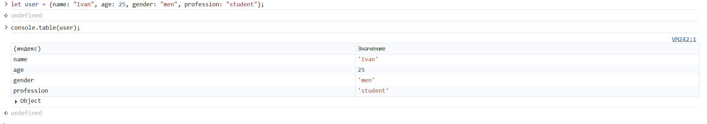
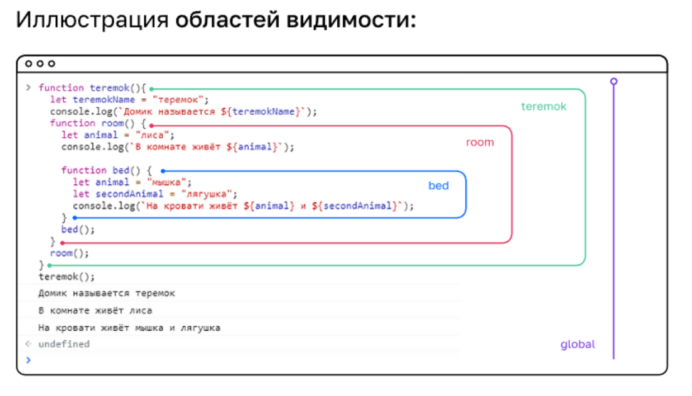

### Обработка исключений и замечаний

Сообщение об ошибках появляются в том случае, если программа не может выполнить код.

Но иногда могут возникать ситуации, когда программа может обработать код, но с точки зрения бизнес-логики это действие не имеет смысла.
В таких случаях появляется необходимость самостоятельного прерывания работы программы с последующим уведомлением об ошибке.

```
function divider (a, b) {
   if ( a === 0 || b === 0) {
      throw new Error("Невалидное значение 0") // если необходимо сохранить ошибки в отдельной переменной const error = new Error("..."); throw error;
   }
   return a - b;
}

```
**Перехват исключений**

Зачем перехватывать исключения
* Нельзя гарантировать, что необходимые данные получены с сервера
* Нельзя гарантировать, что сторонний сервис всегда доступен и корректно работает
* Нельзя гарантировать, что автор библиотеки или тот, кто использует вашу библиотеку, так же добросовестно пишет код, как и вы
* Нельзя гарантировать, что пользователь не сможет ввести некорректные данные, хоть и надо к этому стремиться

Конструкция try..catch позволяет обыграть эту ситуацию.
 * В блоке ```try``` описывается программный код, который браузер должен попытаться выполнить
 * В блоке ```catch``` описывается программный код, который браузер должен выполнить, если в результате выполнения кода в блоке try произошла ошибка
 * В блоке ```finally``` описывается программный код, который будет выполнен независимо от того, произойдёт ошибка в результате выполнения кода в блоке try или нет
   
```
try{
  divider(1,0) 
} catch (error) {
   console.log(error);
} finally {
  // новый код
}

```
**Ошибки**
* синтаксические ошибки - могут возникать, но никогда не перехватываются
* асинхронные ошибки - перехватить можно только там, где они возникают
```
try {
  setTimeout(() => {throw new Error("ошибка!")}, 5000);  // данная функция откладывает действие на заданное количество секунд (5000)
} catch (error) {
   console.log(error);
}
// программа выполнится, но ошибка появится позднее
// такие ошибки должны перехватываться там, где они возникают

setTimeout (() => {
   console.log("мы внутри колбека");
   try {
      console.log("мы внутри try ");
      throw new Error("ошибка!");
   } catch(error) {
      console.log("мы внутри catch ");
      console.log(error);
   }
}
```
**Консольные методы**
* console.log("..."); - выводит обычную информацию в консоль
* console.warn("..."); - выводит сообщение желтым цветом
* console.error("..."); - выводит сообщение красным цветом (для ошибок)
* console.table(user); - выводит информацию о пользователе в виде таблицы

* console.time("метка"); и console.timeEnd("метка"); - используется для замера времени между метками.

**Области видимости**
* глобальна область видимости - внесение изменений в переменную возможно в любой части кода
* функциональная область видимости - внесение изменений возможно только в заданной области функции
```
function keepSecret() {
  let secret = "большой секрет";
  console.log(secret);
}
// при инициации переменной в области функции изменения в ней можно ввести только в пределах этой функции
```

**Замыкания**

Замыкания — это функция вместе со всеми внешними переменными, которые ей доступны
